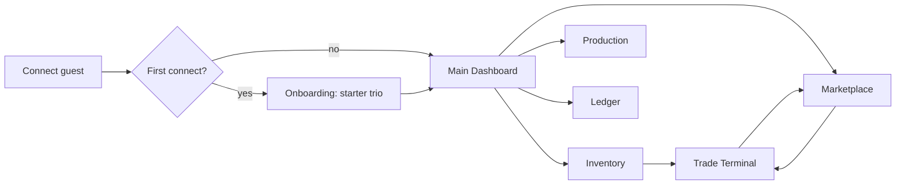

# Fantasy Trader — Mobile UX & UI Spec

**Tracker:** [#24](https://github.com/HaDuve/FantasyEconomySim/issues/24) · Implementation: [#12](https://github.com/HaDuve/FantasyEconomySim/issues/12), [#13](https://github.com/HaDuve/FantasyEconomySim/issues/13), [#14](https://github.com/HaDuve/FantasyEconomySim/issues/14)

Single reference for the v1 trader client: flow, screens, design tokens, component contracts, and GitHub slice mapping. Domain language lives in [`CONTEXT.md`](../../CONTEXT.md); this doc does not redefine economy rules.

**Design source:** UX Pilot export (medieval parchment theme), unpacked to [`design-export/`](./design-export/). Open any `.html` file in a browser for pixel reference or inspect Tailwind classes.

---

## Product framing

| Design copy | Canonical term |
|-------------|----------------|
| Fantasy Trader / Aetheria Markets | **FantasyEconomySim** client |
| Gold / `g` suffix | **Crown** (`CR`) — wallet only, never tradable |
| Character / avatar | **Player** |
| 15-minute tick (onboarding mock) | **Global tick** — **60 seconds** (see `CONTEXT.md`) |
| Iron Ore, Iron Bar, Raw Quartz, etc. | Eight **resources**: `game`, `grain`, `lumber`, `ore`, `herbs`, `ingots`, `potions`, `scrolls` |
| Market / Limit orders (instant) | **Limit** buy/sell **orders**, **GTC**, matched only at **tick auction** |
| Starter profession bonuses (+15% yield, LVL 4) | **Starter trio** only — Hunter, Miner, Herbalist; no level system in v1 |

---

## Session flow

**Navigation (post-onboarding):** sticky header on all main screens — Dashboard · Inventory · Marketplace · Production · Ledger. Header also shows **global tick** countdown (`tickId`, seconds remaining, progress bar) and notification affordance.

| # | Screen | Route (suggested) | Slice | Primary intent |
|---|--------|-------------------|-------|----------------|
| 1 | Welcome & profession selection | `/onboarding` | [#12](https://github.com/HaDuve/FantasyEconomySim/issues/12) | One-time **starter trio** pick + tick economy primer |
| 2 | Main dashboard (tick overview) | `/` | [#12](https://github.com/HaDuve/FantasyEconomySim/issues/12) minimal; [#1](https://github.com/HaDuve/FantasyEconomySim/issues/1) polish | **Wallet**, net worth, tick HUD, shortcuts, alerts |
| 3 | Inventory & storage | `/inventory` | [#12](https://github.com/HaDuve/FantasyEconomySim/issues/12) list; [#14](https://github.com/HaDuve/FantasyEconomySim/issues/14) reserve / **pool buy** | **Resource** quantities, valuation, reserve for production |
| 4 | Resource marketplace | `/market` | [#13](https://github.com/HaDuve/FantasyEconomySim/issues/13) + [#14](https://github.com/HaDuve/FantasyEconomySim/issues/14) **pool buy** | All eight **resources** — price, volume, spread, drill-down |
| 5 | Trade terminal | `/market/:resourceId` | [#13](https://github.com/HaDuve/FantasyEconomySim/issues/13) | **Order book**, chart, **order ticket**, open **orders** |
| 6 | Production assignment | `/production` | [#14](https://github.com/HaDuve/FantasyEconomySim/issues/14) | **Workers**, **buildings**, **assignments**, **conversions** |
| 7 | Historical ledger | `/ledger` | [#12](https://github.com/HaDuve/FantasyEconomySim/issues/12) read-only | **Settlement** history by **tick** |

---

## Screen specs

### 1 — Welcome & profession selection

**Design file:** `design-export/1-Fantasy Trader - Welcome & Pro.html`

| Region | Content | v1 data / behavior |
|--------|---------|-------------------|
| Hero | Tick economy explainer | Copy: state advances on **global tick**; markets match once per tick (use **60s**, not design’s “15 min”) |
| Profession grid | Hunter, Miner, Herbalist cards | `STARTER_TRIO_PROFESSION_IDS` from domain; single select |
| Detail pane | Selected profession summary | Hunter → **field work** / `game`; Miner → Mine + `ore`; Herbalist → shop + `herbs` |
| Footer CTA | Confirm profession | Send once to server with first connect; triggers **starter package** (100 **crowns**, 1 **worker**, no **buildings**) |
| Header: Skip Tutorial | Skip tick explainer only | Optional: collapse hero / jump to profession grid; **starter trio** pick remains **mandatory** on first connect |
| Guest / upgrade | (not on this screen) | Anonymous **guest** is the default connect path; **upgrade** to a linked account is a separate settings flow ([#15](https://github.com/HaDuve/FantasyEconomySim/issues/15)) |

**Drop from mock:** fictional starter bonuses (+15% pelt yield, LVL, wrong starter inventory copy).

---

### 2 — Main dashboard (tick overview)

**Design file:** `design-export/2-Fantasy Trader - Main Dashboar.html`

| Region | Content | v1 data / behavior |
|--------|---------|-------------------|
| Tick HUD | `TICK n`, time remaining, bar | WebSocket snapshot: `tickId`, phase progress to next **global tick** |
| Portfolio | Total net worth, liquid **crowns**, asset value | `wallet` + mark-to-market **inventory** (last trade or mid from book) |
| Portfolio chart | Area sparkline | Optional v1; can defer |
| Command center | Shortcuts to Market, Inventory, Production, Ledger | Deep links |
| Resource markets | Mini cards + sparklines | Subset or all 8 **resources**; tap → Trade terminal |
| Active operations | Production / fill alerts | Filled **orders**, **assignment** output, low **crowns** for **upkeep** |
| Open orders strip | Recent activity | Deep link to terminal or ledger |

**Slice [#12](https://github.com/HaDuve/FantasyEconomySim/issues/12):** tick HUD, **wallet** balance, command-center shortcuts, connection status.

**Post-MVP polish (parent [#1](https://github.com/HaDuve/FantasyEconomySim/issues/1)):** portfolio chart, net-worth delta, full resource sparkline grid.

---

### 3 — Inventory & storage

**Design file:** `design-export/3-Fantasy Trader - Inventory & S.html`

| Region | Content | v1 data / behavior |
|--------|---------|-------------------|
| Capacity bar | Weight / expand storage | **Out of v1** — single **inventory**, no weight cap in domain |
| Storage locations | Primary vault, outpost | **Out of v1** |
| Resource table | Qty, avg cost, market val, trend, actions | Qty from **inventory**; market val from book; avg cost only if server tracks cost basis (else hide) |
| Row action: Pool buy | Buy from **supply pool** | Tier 1–2 **resources** only; see [Pool buy](#pool-buy-14) |
| Reserve panel | Stock reserved for production | v1: optional “reserved” qty if **conversion** inputs locked same tick |
| Transfer panel | Move between locations | **Out of v1** |

**Slice [#12](https://github.com/HaDuve/FantasyEconomySim/issues/12):** read-only qty table. **Slice [#14](https://github.com/HaDuve/FantasyEconomySim/issues/14):** reserve + **pool buy** row action.

---

### 4 — Resource marketplace (auction board)

**Design file:** `design-export/4-Fantasy Trader - Resource Mark.html`

| Region | Content | v1 data / behavior |
|--------|---------|-------------------|
| Ticker grid | 8 **resource** cards: last price, Δ%, volume, mini chart | One card per `RESOURCE_IDS`; tap → `/market/:resourceId` |
| Card action: Pool buy | Instant buy at **pool price** | Tier 1–2 only (`grain`, `game`, `lumber`, `ore`, `herbs`); see [Pool buy](#pool-buy-14) |
| Depth / heat table | Bid vs ask volume | Aggregated book levels per **resource** |
| Featured detail | Highlight one **resource** | Same as terminal header stats |

**Slice [#13](https://github.com/HaDuve/FantasyEconomySim/issues/13):** browse + drill-down. **Slice [#14](https://github.com/HaDuve/FantasyEconomySim/issues/14):** **pool buy** entry on eligible cards.

---

### 5 — Trade terminal (resource detail)

**Design file:** `design-export/5-Fantasy Trader - Trade Termina.html`

| Region | Content | v1 data / behavior |
|--------|---------|-------------------|
| Resource header | Name, tier badge, last / high / low / vol | Per-**resource** snapshot after each **tick** |
| Order book | Asks, spread, bids; depth bars | Pre-**tick auction** book levels; see [Live Order Book](#live-order-book-component) |
| Recent trades | Price, amount, time | Last **settlements** for this **resource** (tick time, not wall clock if easier) |
| Price chart | Tick / 1m / 5m / 1h tabs | v1: **per-tick** series only; defer intraday intervals |
| Order ticket | Buy/Sell, Limit only | **Limit** **order** place/cancel via WebSocket; no mid-tick fill messaging |
| Open orders | Player’s GTC **orders** | Cancel action; refresh on tick broadcast |
| Holdings sidebar | Qty available to sell | **Inventory** minus reservations |

**Issue:** [#13](https://github.com/HaDuve/FantasyEconomySim/issues/13)

---

### 6 — Production assignment

**Design file:** `design-export/6-Fantasy Trader - Production As.html`

| Region | Content | v1 data / behavior |
|--------|---------|-------------------|
| Active profession | Hunter / Miner / Herbalist tabs | Show owned **workers**; not a class level system |
| Recipe list | **Conversion** cards (inputs → output) | Map to `CONTEXT.md` recipe table (`ore`→`ingots`, etc.) |
| Production queue | Multi-slot queue, pause, % progress | **Simplify v1:** one **assignment** per **building**; yield resolves each **global tick** (no sub-tick progress) |
| Building / worker status | Mine, Smithy, Magic School | **Private building** purchase; **public building** + **facility fee** + **seat cap** (1) |
| Reserve toggle | Auto-reserve inputs | Align with server validation for **conversion** inputs |
| Upkeep summary | **Crowns** per tick | Show **upkeep** + **facility fee** before next tick |

**Issue:** [#14](https://github.com/HaDuve/FantasyEconomySim/issues/14)

---

### 7 — Historical ledger (settlements)

**Design file:** `design-export/7-Fantasy Trader - Historical Le.html`

| Region | Content | v1 data / behavior |
|--------|---------|-------------------|
| Filters | Event type, tick range, search | Types: trade **settlement**, **order** placed/cancelled, **production**, **pool buy**, **upkeep**, **facility fee** |
| Table | Tick, event, **resource**, amount, price/fee, P&L | Rows from immutable **settlement** history on **ledger** |
| Tick summary | Net P&L, per-**resource** deltas | Aggregate last N **ticks** |
| Export | Download ledger | Defer or CSV later |

**Note:** Design uses `g` for crowns; use `CR` in UI.

**Slice [#12](https://github.com/HaDuve/FantasyEconomySim/issues/12):** read-only table + tick filter (minimal v1). **Slice [#13](https://github.com/HaDuve/FantasyEconomySim/issues/13):** “Recent trades” tape on trade terminal covers per-**resource** trade history until full ledger ships.

---

## Pool buy ([#14](https://github.com/HaDuve/FantasyEconomySim/issues/14))

**Pool buy** is not a separate screen; it is a sheet/modal launched from existing surfaces. Only tier 1–2 **resources** with **world drip** stock in the **supply pool** are eligible (`grain`, `game`, `lumber`, `ore`, `herbs`).

| Entry point | Trigger | Sheet content |
|-------------|---------|---------------|
| Marketplace card | “Pool buy” on eligible **resource** | **Resource** name, **pool price** (CR/unit), qty stepper, total **crowns**, confirm |
| Inventory row | “Buy from pool” on eligible row | Same sheet; pre-selected **resource** |
| Production (optional) | Missing **conversion** input hint | Deep link to pool buy for staple inputs; defer if #14 scope is tight |

**Behavior:** debits **wallet**, credits **inventory** immediately (not a player **order**). Show server validation errors (insufficient **crowns**, empty **supply pool**). No **pool buy** for `ingots`, `potions`, `scrolls`.

---

## Design system (medieval parchment — authoritative)

Taken from exported HTML (`:root` CSS variables). Implement as Expo theme tokens (not necessarily Tailwind on device).

### Color tokens

| Token | Hex | Usage |
|-------|-----|--------|
| `background` | `#f5f1e6` | Page parchment |
| `foreground` | `#4a3f35` | Body text |
| `card` | `#fffcf5` | Panels |
| `primary` | `#a67c52` | Accents, tick bar, selected borders |
| `secondary` | `#e2d8c3` | Secondary surfaces |
| `muted` | `#ece5d8` | Subtle fills |
| `muted-foreground` | `#7d6b56` | Labels |
| `accent` | `#d4c8aa` | Ask side text / highlights |
| `destructive` | `#b54a35` | Sells, warnings, negative Δ |
| `border` | `#dbd0ba` | Dividers |
| `bid` (semantic) | `#2D4F1E` | Buy side, positive P&L |
| `ask-depth` | `rgba(181, 74, 53, 0.1)` | Ask depth bar |
| `bid-depth` | `rgba(45, 79, 30, 0.1)` | Bid depth bar |

**Background texture:** `parchment.png` pattern URL in HTML — replace with bundled asset or subtle RN gradient.

### Typography

| Role | Font |
|------|------|
| Headings (`h1`–`h6`) | Libre Baskerville |
| Body | Lora |
| Numbers (prices, ticks, tables) | IBM Plex Mono |

### Shared primitives

**`GlassPanel`** — card container:

- Background: `card` at ~85% opacity
- `backdrop-blur` ~8px (BlurView on native)
- Border: `border`, soft shadow
- Radius: `0.25rem` base (`--radius`)

**`MainHeader`** — sticky; logo; nav; **TickHud**; notifications; profile/guest indicator.

**`TickHud`** — hourglass icon; `TICK {tickId}`; `{secondsRemaining}`; horizontal progress.

**Charts** — design uses Plotly; mobile v1: lightweight chart lib or static spark SVG from tick snapshots.

**Icons** — Font Awesome 6 mapping per **resource** (define once in `resource-icons.ts`).

### Deprecated palette (early brainstorm)

Dark glass (`#0B0F19`, neon purple `#6E06F2`, pink/green book) was superseded by parchment theme. Do not mix both in one build.

---

## Live Order Book component

First vertical slice for [#13](https://github.com/HaDuve/FantasyEconomySim/issues/13). Reference: Trade terminal left column in `5-Fantasy Trader - Trade Termina.html`.

### Layout

- Title: “Order Book”; optional overflow menu (defer actions v1).
- Columns: **Price** | **Amount** | **Total** (10px uppercase labels).
- **Asks** (sells): scrollable section above spread; prices **descending** (best ask nearest spread).
- **Spread row** (pinned): last trade price + `Spread: {bestAsk - bestBid}`.
- **Bids** (buys): scrollable below spread; prices **descending** (best bid nearest spread).

### Row styling

- Monospace numerals.
- **Depth bar:** width = `amount / maxAmountInSide` (0–100%); ask bar from **left** (`destructive` tint); bid bar from **right** (`bid` tint).
- Hover / press: muted row highlight.

### Behavior (v1)

| Rule | Detail |
|------|--------|
| Data source | Server book snapshot per **resource**; update on tick broadcast only |
| Scroll | Asks and bids scroll independently; spread stays fixed |
| Tap row | Prefill **order ticket** price (and optional amount) — wire when ticket exists |
| No instant fill | Helper copy: “Fills at next **tick auction**” |
| **Crown** | Never listed as a row |

### Acceptance

- [ ] Renders empty, one-sided, and two-sided books
- [ ] Depth bars scale to max on each side
- [ ] Spread math matches server best bid/ask
- [ ] Tap propagates price to ticket
- [ ] Accessible labels for buy/sell sides

---

## Resource ↔ UI labels

| `resourceId` | Display | Icon hint (FA) |
|--------------|---------|----------------|
| `game` | Game | `fa-drumstick-bite` |
| `grain` | Grain | `fa-wheat-awn` |
| `lumber` | Lumber | `fa-tree` |
| `ore` | Ore | `fa-cubes` |
| `herbs` | Herbs | `fa-leaf` |
| `ingots` | Ingots | `fa-cube` |
| `potions` | Potions | `fa-flask` |
| `scrolls` | Scrolls | `fa-scroll` |

---

## Implementation notes

| Topic | Guidance |
|-------|----------|
| Stack | Expo React Native (`apps/mobile`); ADR-0001 — designs are web HTML as **visual spec**, not copy-paste web app |
| Styling | Map tokens to `StyleSheet` or NativeWind; reuse semantic names (`primary`, `destructive`, `bid`) |
| Sync | WebSocket: balances, book, tick id ([#11](https://github.com/HaDuve/FantasyEconomySim/issues/11)) |
| Auth | Firebase anonymous **guest**; **upgrade** retains **player** id ([#15](https://github.com/HaDuve/FantasyEconomySim/issues/15), [#22](https://github.com/HaDuve/FantasyEconomySim/issues/22)) |
| Export designs | Open `design-export/*.html` in browser; see [`design-export/README.md`](./design-export/README.md) |
| Code export | HTML includes Tailwind CDN + inline config — useful for web prototype only |

### Suggested build order

1. Theme tokens + `GlassPanel` + `MainHeader` + `TickHud` ([#12](https://github.com/HaDuve/FantasyEconomySim/issues/12))
2. Onboarding → starter trio ([#12](https://github.com/HaDuve/FantasyEconomySim/issues/12))
3. **Live Order Book** + order ticket + marketplace list ([#13](https://github.com/HaDuve/FantasyEconomySim/issues/13))
4. Production + pool buy ([#14](https://github.com/HaDuve/FantasyEconomySim/issues/14))
5. Screen 7 ledger (read-only) on [#12](https://github.com/HaDuve/FantasyEconomySim/issues/12); dashboard charts/polish deferred under [#1](https://github.com/HaDuve/FantasyEconomySim/issues/1)

### GitHub slices (parent [#1](https://github.com/HaDuve/FantasyEconomySim/issues/1))

| Issue | Screens / components |
|-------|---------------------|
| [#12](https://github.com/HaDuve/FantasyEconomySim/issues/12) | **1** onboarding, **2** minimal dashboard (tick HUD, **wallet**, shortcuts), **3** inventory qty list, **7** read-only ledger, `MainHeader`, guest connect |
| [#13](https://github.com/HaDuve/FantasyEconomySim/issues/13) | **4** marketplace, **5** trade terminal, Live Order Book, order ticket, recent-trades tape |
| [#14](https://github.com/HaDuve/FantasyEconomySim/issues/14) | **3** reserve + row **pool buy**, **4** card **pool buy**, **6** production / buildings / **assignments** |
| [#1](https://github.com/HaDuve/FantasyEconomySim/issues/1) (post-MVP) | **2** full dashboard polish (portfolio chart, sparkline grid, net-worth delta) |

---

## Design export inventory

Filenames are truncated by the UX Pilot exporter (`Dashboar`, `Pro`, `S`, etc.); paths below are authoritative.

| File | Screen |
|------|--------|
| `1-Fantasy Trader - Welcome & Pro.html` | Onboarding |
| `2-Fantasy Trader - Main Dashboar.html` | Dashboard |
| `3-Fantasy Trader - Inventory & S.html` | Inventory |
| `4-Fantasy Trader - Resource Mark.html` | Marketplace |
| `5-Fantasy Trader - Trade Termina.html` | Trade terminal |
| `6-Fantasy Trader - Production As.html` | Production |
| `7-Fantasy Trader - Historical Le.html` | Ledger |

See [`design-export/README.md`](./design-export/README.md) before treating HTML as domain truth.

---

## Open questions

- Cost basis / avg cost on **inventory** — server field or UI omit in v1?
- Net worth formula — mid price vs last trade vs **pool price** for unstorable tiers?
- Ledger event taxonomy — final enum from server **settlement** types?
- Chart library for Expo — Skia, victory-native, or defer charts to slice 2?
